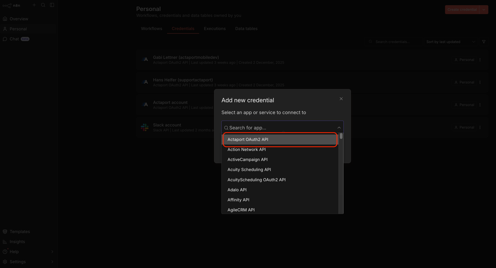
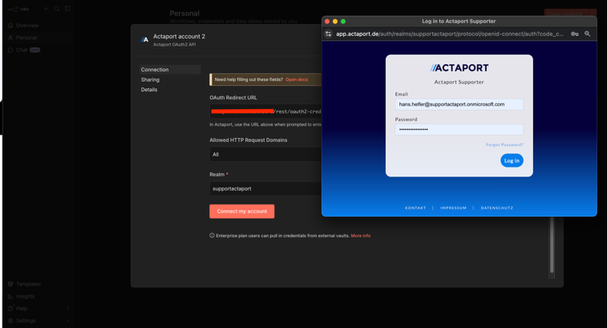
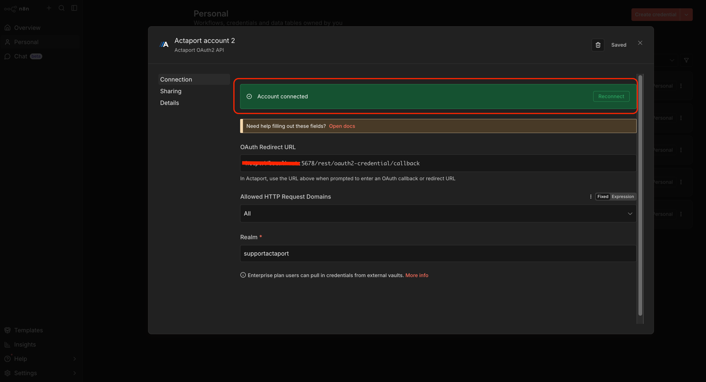

# n8n-nodes-actaport

This is an n8n community node. It lets you use Actaport in your n8n workflows.

Actaport is a cloud-based legal management platform that helps law firms streamline their daily work.

[n8n](https://n8n.io/) is a [fair-code licensed](https://docs.n8n.io/sustainable-use-license/) workflow automation
platform.

[Installation](#installation)
[Operations](#operations)
[Credentials](#credentials)
[Compatibility](#compatibility)
[Usage](#usage)
[Resources](#resources)
[Version history](#version-history)

## Installation

Follow the [installation guide](https://docs.n8n.io/integrations/community-nodes/installation/) in the n8n community
nodes documentation.

1. Go to **Settings > Community Nodes**.
2. Select **Install**.
3. Enter `n8n-nodes-actaport` in **Enter npm package name**.
4. Agree to the [risks](https://docs.n8n.io/integrations/community-nodes/risks/) of using community nodes: select **I
   understand the risks of installing unverified code from a public source**.
5. Select **Install**.

After installing the node, you can use it like any other node. n8n displays the node in search results in the **Nodes**
panel.

## Operations

| Resource                              | Supported Operations                      |
|---------------------------------------|-------------------------------------------|
| **Additional Information Categories** | get, getAll                               |
| **Case File**                         | get, getAll, create, update               |
| **Collision Check**                   | get                                       |
| **Contact**                           | get, getAll, create, update               |
| **Deadline**                          | get, getAll, create, update               |
| **Document**                          | get, getAll, update, download             |
| **Expense**                           | get, getAll, create, update, delete       |
| **Folder**                            | get, getAll                               |
| **Invoice**                           | get, getAll                               |
| **Note**                              | get, getAll, create, update               |
| **Resubmission**                      | get, getAll, create, update, updateStatus |
| **RVG Fee**                           | get, getAll, create, update, delete       |
| **Task**                              | get, getAll, create, update, updateStatus |
| **Third Party Cost**                  | get, getAll, create, update, delete       |
| **User**                              | get, getMe, getAll                        |

## Credentials

### Prerequisites
1. An active Actaport account. If you don't have one, sign up at [Actaport](https://www.actaport.de/).
2. API access enabled for your Actaport account. Contact [Actaport support](https://actaport.zendesk.com/hc/de/requests/new) if you need assistance with this step.

### Setting up Actaport credentials in n8n
1. In n8n, locate the **Credentials** section and click on **Create credential**.
2. Select **Actaport OAuth2 API** from the list.
3. Fill in your realm once prompted and click on **Connect my account**.
4. Once redirected to the Actaport login page, enter your Actaport credentials to authorize n8n.
5. After successful authentication, n8n will store the access token securely for future API requests

## Compatibility

* n8n Nodes API version: 1
* Node.js: >= 20.15

## Resources

* [n8n community nodes documentation](https://docs.n8n.io/integrations/#community-nodes)
* [Actaport Homepage](https://www.actaport.de/)
* [Actaport Developer Documentation](https://api.actaport.de/api-docs)
* [Actaport REST API Reference](https://api.actaport.de/api-docs/rest-api/reference/public)
* [Actaport Technical Support](https://www.actaport.de/kontakt/api-anfrage)

# Version history
* 0.1.0 - Initial release of the n8n Actaport node, supporting multiple resources and operations (see [Operations
  section](#operations) for details).